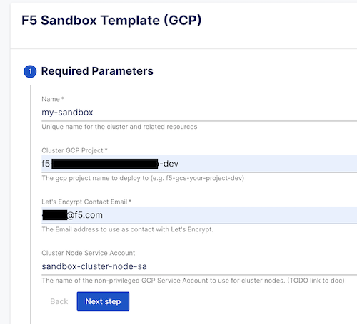

# Applab Sandbox Install Instructions

1. Create an unprivileged service account for GKE nodes:

```text
gcloud iam service-accounts create sandbox-cluster-node-sa \
    --description="Service Account For GKE Cluster Nodes" \
    --display-name="Cluster Node Service Account"
```

2. Create a priviledged deployer Service Account:

```text
gcloud iam service-accounts create deployer-sa \
    --description="Service Account Used with Porter to deploy GCP assets" \
    --display-name="Porter Deploy Service Account"

gcloud projects add-iam-policy-binding PROJECT_ID \
    --member="serviceAccount:deployer-sa@PROJECT_ID.iam.gserviceaccount.com" \
    --role="roles/iam.serviceAccountUser"

gcloud projects add-iam-policy-binding PROJECT_ID \
    --member="serviceAccount:deployer-sa@PROJECT_ID.iam.gserviceaccount.com" \
    --role="roles/container.admin"

gcloud projects add-iam-policy-binding PROJECT_ID \
    --member="serviceAccount:deployer-sa@PROJECT_ID.iam.gserviceaccount.com" \
    --role="roles/container.clusterAdmin"

gcloud projects add-iam-policy-binding PROJECT_ID \
    --member="serviceAccount:deployer-sa@PROJECT_ID.iam.gserviceaccount.com" \
    --role="roles/compute.networkAdmin"

gcloud projects add-iam-policy-binding PROJECT_ID \
    --member="serviceAccount:deployer-sa@PROJECT_ID.iam.gserviceaccount.com" \
    --
```

3. Navigate to [Applab Demo Interface](https://app.backstage.demo.f5octo.dev/) and select
"F5 Sandbox Cluster (GCP)" from the "Deploy A Bundle" widget.

4. Set the Name for your sandbox cluster, the GCP project you're deploying to, your email address,
and the name of the Node Service Account created above (sandbox-cluster-node-sa).



5. On the Next section, specify a DNS domain to use (TODO: This should be automated at project onboarding?) for the cluster.

6. Optional: Specify OIDC Client connection parameters, or leave the rest as-is for local DEX authentication.

7. On the Next section (at some point you'll be prompted to authorize your Gitlab account so it can write out the repo):
    * Specify gitlab.com as the destination host.
    * Set the Owner field to your gitlab.com username (under your full name in the gitlab.com interface profile dropdown).
    * Set the target repo to wherever you want to write the files to.

8. Click Next, Then Create. Verify the provided info (values can be modified later in /cluster/params.yaml in the repo).

9. Once you see "Finished step Publish" there will be a link to your new repo on the left. Navigate there and select SANDBOX_README.md
for remaining instructions (you can skip to the Deploy with Gitlab Runner or Porter CLI sections).